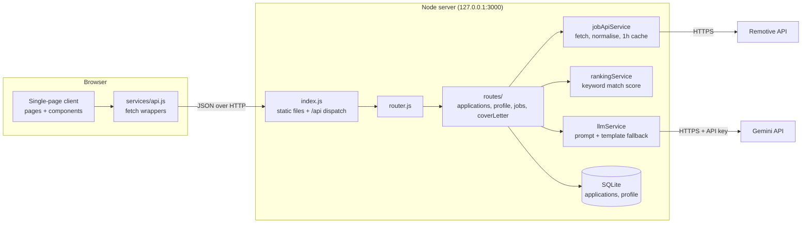

# Job Tracker

Phase 1 project: track job applications, browse real postings ranked by how well they match your profile, and draft cover-letter openings with AI.

## Run it

Requires **Node.js 22.13 or newer** (it uses the built-in `node:sqlite`). There is nothing to install.

```
npm start
```

Open http://localhost:3000. The server only accepts connections from your own computer. Your data is stored in `server/db/jobtracker.db`, which is created on first run.

Optional environment variables:

| Variable | Purpose |
| --- | --- |
| `GEMINI_API_KEY` | Enables AI-written cover letters. Without it you get a clearly labelled template draft. Get one at https://aistudio.google.com/apikey. |
| `GEMINI_MODEL` | Model used for drafts (default `gemini-flash-latest`). |
| `PORT` | Server port (default `3000`). |
| `DB_PATH` | Database file location. |

Put them in a `.env` file in the project folder (loaded automatically by `npm start`, and ignored by git): copy `.env.example` to `.env` and fill in your key. Or set them inline: `GEMINI_API_KEY=... npm start` (on Windows PowerShell: `$env:GEMINI_API_KEY="..."; npm start`).

**Privacy note.** Drafting a cover letter sends your profile and the job description to Google's Gemini API. On the free tier, Google may use that text to improve its products, and human reviewers may read it; on a paid (billing-enabled) key it is not used that way. Leave anything out of your profile that you would not want shared. See the [Gemini API terms](https://ai.google.dev/gemini-api/terms).

## Features

1. **Application tracker.** Add, edit, delete and filter applications by status (wishlist, applied, interview, offer, rejected). Deadlines turn orange within 7 days and red when overdue.
2. **Job feed.** Pulls remote job postings from the free [Remotive](https://remotive.com/api/remote-jobs) API (credited on the feed page, as their terms require) and ranks them against your profile. Each card shows a match percentage and which of your skills were found. If the API cannot be reached it shows clearly labelled sample postings instead. Results are cached for an hour.
3. **Cover letter assistant.** Sends the job and your profile to Gemini and returns an editable opening paragraph. The prompt tells the model to use only facts from your profile.

Fill in the **Profile** page first: skills and target roles drive the ranking, and the summary is the only personal background the cover letter may use.

### How the match score works

Plain keyword overlap, so every score can be explained on screen. Each of your skills (up to 5 count toward the total) earns up to 3 points: 2 if it is in the posting's tags, 1 if it is in the description, and a title mention can stand in for a missing tag. A target role whose words all appear in the title adds 6. Junior-sounding titles get a small boost for entry/junior profiles and senior titles a penalty. The total is scaled to 0-100.

## Tech stack

| Layer | Technology |
| --- | --- |
| Runtime | Node.js 22.13+ (ES modules), no npm dependencies |
| Backend | Built-in `node:http` server with a small hand-written router (`server/router.js`) |
| Database | SQLite through the built-in `node:sqlite` module, WAL mode, schema in `server/db/schema.sql` |
| Frontend | Plain HTML, CSS and JavaScript ES modules: no framework, no bundler, no build step |
| Client routing | Hash-based single-page router (`client/app.js`) |
| Job data | [Remotive](https://remotive.com) public API over the built-in `fetch`, cached in memory for an hour |
| AI | Google Gemini `generateContent` REST API (default model `gemini-flash-latest`) |
| Config | `.env` file loaded by Node's `--env-file-if-exists` flag |
| Tests | Built-in `node:test` runner and `node:assert` |

## System architecture

The app is one Node process that serves both the frontend files and a JSON API, plus two outside services it calls on your behalf.



**Layers**

- **Client (`client/`).** `index.html` loads `app.js`, which maps the URL hash to a page function (Dashboard, ApplicationForm, JobFeed, CoverLetter, Profile). Pages build DOM nodes with the `h()` helper in `components/dom.js` and reach the backend only through `services/api.js`. `state.js` holds the little state that pages share, such as the job handed from the feed to the cover-letter page.
- **HTTP layer (`server/index.js`, `server/router.js`).** Requests under `/api/` go to the router, which matches method and path, parses the JSON body (1 MB limit) and turns thrown `HttpError`s into JSON error responses. Everything else is served as a static file from `client/`, with path-traversal protection and a fallback to `index.html`.
- **Routes (`server/routes/`).** Validate input and coordinate the database and services. They hold no business logic of their own beyond validation.
- **Services (`server/services/`).** `jobApiService` fetches and normalises Remotive postings and caches them; `rankingService` scores each posting against the profile; `llmService` builds the prompt, calls Gemini and falls back to a template draft.
- **Data (`server/db/`).** One SQLite file with two tables: `applications` (company, role, status, deadline, link, notes, timestamps) and `profile` (a single row: name, skills, target roles, experience, summary).

**Request flows**

- **Tracking an application.** Page → `POST /api/applications` → validation → SQLite insert → the saved row is returned. If the link is already saved, the existing row is returned instead.
- **Job feed.** Page → `GET /api/jobs` → `jobApiService` returns cached postings or fetches from Remotive (sample postings if that fails) → `rankingService` scores them against the profile row → the top 50 are returned, best match first.
- **Cover letter.** Page → `POST /api/cover-letter` → the profile is read from SQLite → `llmService` sends the profile and job to Gemini → the paragraph is returned. With no key, or if the call fails, a labelled template draft is returned instead.

**Security and privacy boundaries**

- The server listens on `127.0.0.1` only and has no login: it is a single-user app for your own machine.
- The Gemini key stays on the server (read from `.env`) and is never sent to the browser.
- The only data that leaves your machine is the search keywords and category sent to Remotive, and the profile and job description sent to Gemini when you draft a letter.

## Project structure

```
client/                     no-build frontend (plain ES modules)
  index.html, app.js        shell and hash router
  pages/                    Dashboard, ApplicationForm, JobFeed, CoverLetter, Profile
  components/               ApplicationCard, JobCard, StatusBadge, dom helpers
  services/api.js           fetch wrappers for the backend
server/
  index.js                  HTTP server, static files, route registration
  router.js                 tiny router (no Express)
  routes/                   applications, profile, jobs, coverLetter
  services/                 jobApiService, rankingService, llmService, sampleJobs
  db/                       schema.sql, db.js
  test/                     backend tests
```

## API

| Method | Path | Notes |
| --- | --- | --- |
| GET / POST | `/api/applications` | list (optional `?status=`), create. Creating with a `link` that is already saved returns the existing row with `duplicate: true` |
| GET / PUT / DELETE | `/api/applications/:id` | |
| GET / PUT | `/api/profile` | single profile row |
| GET | `/api/jobs` | `?q=`, `?category=`, `?refresh=1`, `?min=` (minimum match) |
| POST | `/api/cover-letter` | body `{ job: { title, company, description? } }` |

## Tests

```
npm test
```

Runs the backend tests (CRUD, validation, ranking, job normalisation, and the AI request/fallback logic against a local mock of the Gemini API). Tests use an in-memory database and never touch your real data.

## Why no React or Express?

The project was built in an environment where npm installs were blocked, so it uses only what ships with Node. That also means there is no build step and no `node_modules`.
