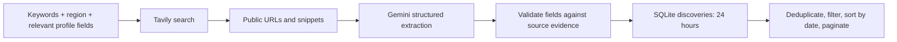

# Job Tracker

Track applications, search several job boards by region, discover additional openings with web search and AI extraction, and draft cover-letter openings.

## Run

Requires **Node.js 22.13 or newer** for built-in `node:sqlite`. There are no npm dependencies or build steps.

```sh
npm start
```

Open http://localhost:3000. The single-user server listens on `127.0.0.1` only and has no login. SQLite is created automatically at `server/db/jobtracker.db`; existing application/profile data is preserved when the new tables are created.

Copy `.env.example` to `.env` to configure optional services. Both keys stay on the server; `.env` is ignored by git.

| Variable | Purpose |
| --- | --- |
| `GEMINI_API_KEY` | Enables AI cover letters; also required for web discovery. |
| `TAVILY_API_KEY` | Enables web search when Gemini is also configured. Get a key from [Tavily](https://app.tavily.com/). |
| `GEMINI_MODEL` | Cover-letter model; default `gemini-flash-latest`. |
| `GEMINI_SEARCH_MODEL` | Job extraction model supporting JSON schema; default `gemini-3.8-flash`. |
| `PORT` | Local server port, default `3000`. |
| `DB_PATH` | SQLite file location. |

Normal job-board browsing requires **no API keys**. Web discovery is an explicit button action and can incur Tavily and Gemini charges. No background AI searches run.

## Usage

1. Fill in **Profile** with skills, target roles, experience and a short background.
2. In **Job Feed**, select a region and optionally keywords, category and source. Use **Load more** for additional results.
3. Under **Go beyond the feeds**, choose a **Web search target**: Entire web, Company career sites (ATS), LinkedIn or Indeed. Click **Search the web with AI**. Keywords and region apply; when keywords are blank, profile roles or skills provide the query. Category and source filters apply to the feed only.
4. Save interesting jobs to the tracker, update their status and deadlines, or draft a cover-letter opening.

Regions are **All regions, Seoul, North America, Europe, Singapore and Hong Kong**. Region matching uses the source's location text and common country/city aliases. Explicit worldwide remote eligibility can match each region. A generic “Remote” location is not treated as permission to work from every country. This is a conservative text filter, not a visa, timezone or work-authorization check; unknown locations remain visible under All regions.

## Job collection

Three independent adapters fetch in parallel:

| Source | Scope | Cache interval |
| --- | --- | --- |
| [Remotive](https://github.com/remotive-com/remote-jobs-api) | Complete public remote-job feed, without the old 100-job request limit. The source delays public listings by 24 hours. | 6 hours |
| [Arbeitnow](https://www.arbeitnow.com/blog/job-board-api) | Primarily European jobs, including onsite and remote roles; follows up to five official API pages. | 1 hour |
| [Remote OK](https://remoteok.featurebase.app/help/articles/3140840-is-there-an-api-or-rssjson-feed-of-remote-jobs) | Public remote-job feed; excludes the metadata row. | 1 hour |

Provider snapshots persist in SQLite. Filters and refreshes reuse snapshots within their intervals, including after a restart. Concurrent feed requests share in-flight fetches. An unavailable source does not discard the other sources. If available, a snapshot up to seven days old is shown as older cached data; otherwise that source returns no jobs. Failed requests have a one-minute retry backoff. **Failures never substitute fictional sample jobs.**

The collector normalizes source records, rejects unsafe links and explicitly expired/closed records, and merges duplicates by canonical URL or matching company/title/location across sources. Same-source requisitions and different locations are retained; each merged result preserves attribution links. Title-based cross-source merging remains a heuristic and may combine similar requisitions.

Keyword, category, region and source filters apply together. Results are ordered by publication date before pagination; discovery time is used when a publication date is missing, with a stable ID tie-breaker. The API returns 25 jobs per page by default, up to 100, plus total count and `hasMore`; there is no fixed 50-result ceiling.

Public feeds are strongest for Europe and remote work. Seoul, Singapore and Hong Kong may have few feed results. Web discovery broadens coverage but cannot guarantee exhaustive results. “Listed” means the provider supplied the job; the application form is not independently checked on every request.

## Web discovery

To enable this feature, get a search key from [Tavily](https://app.tavily.com/) and a model key from [Google AI Studio](https://aistudio.google.com/apikey), set `TAVILY_API_KEY` and `GEMINI_API_KEY` in the project `.env`, and restart `npm start`. For example, select **Seoul**, enter `backend engineer`, choose **LinkedIn**, then click **Search the web with AI**. No LinkedIn or Indeed account credentials are collected by this app.

**Entire web** can find public company career pages and job boards without integrating each board's API. **Company career sites (ATS)** focuses on supported employer recruiting domains such as Greenhouse, Lever, Ashby, Workday and SmartRecruiters; custom company career domains remain covered by Entire web. **LinkedIn** and **Indeed** restrict search to those sites and accept individual posting URLs only. Their results can also be filtered in the feed's Source selector.

These are public web-search results, not an authenticated search of the sites' complete databases. Some pages may be absent from the search index or require sign-in to read/apply. The app does not automate account login or bypass access checks. Their official APIs are different integrations: [LinkedIn Job Posting](https://learn.microsoft.com/en-us/linkedin/talent/job-postings/api/overview) and [Indeed Job Sync](https://docs.indeed.com/job-sync-api) principally handle employer/ATS posting workflows.



`jobDiscoveryService.js` separates search from model extraction. Tavily performs up to two searches per click, with domain restrictions for the selected target (and an employer/ATS query in Entire web mode). Gemini reads the returned snippets and proposes structured job fields. It cannot create the final URL: each accepted job points to an actual Tavily result selected by source index. Company, title and quoted evidence must occur in the source. Known listing pages, unsafe links, unsupported fields and explicitly closed/expired postings are excluded. Weak evidence produces fewer results, possibly zero, rather than invented jobs.

All accepted discoveries are labeled **Check availability**. Search snippets can be outdated and are not proof that applications are still open. Region information that cannot be supported by the source is left empty. The original posting is the place to confirm eligibility and availability.

The complete search/extraction operation has a 40-second deadline. If Gemini rejects structured-output fields with HTTP 400, extraction retries once with the schema in the prompt and validates the JSON and source evidence on the server. A successful compatibility mode is remembered per model until restart, so the rejected request is not repeated on each search. Authentication errors, unavailable models, quota errors and model overload do not trigger this retry. Identical searches share in-flight work and use a one-hour bounded memory cache; stored discoveries expire after 24 hours and are capped at 1,000 records. Refreshing feeds does not automatically repeat paid searches. Discovery failures leave existing listings untouched.

Search uses the [Tavily Search API](https://docs.tavily.com/documentation/api-reference/endpoint/search) and [Gemini structured outputs](https://ai.google.dev/gemini-api/docs/generate-content/structured-output). It does not use Gemini Google Search grounding to build a job database; that service has separate [restrictions on indexing grounded results](https://ai.google.dev/gemini-api/terms#grounding-with-google-search). No separate model hosting or GPU is needed; model calls happen on the application server.

## Other features

- **Application tracker:** add/edit/delete company, role, status, deadline, posting link and notes; filter by wishlist/applied/interview/offer/rejected. Deadlines are highlighted within seven days or when overdue. Saving an existing posting URL returns the existing application.
- **Cover letters:** generate an editable opening paragraph and copy it. The prompt asks Gemini to use profile facts only. Missing keys/API failures return a labeled template. Drafts are not saved automatically.
- **Profile:** reusable background for web-search queries and cover-letter drafts. Job cards show source tags without personal fit percentages or experience-fit judgments.

## Data and privacy

Applications, profiles, source snapshots and web discoveries are stored locally in SQLite. Normal feed requests download public data; local filters do not send your profile to job boards. Web discovery sends search terms built from keywords, region, skills, target roles and experience to Tavily, and sends those criteria plus public search snippets to Gemini. It excludes profile name and summary. Cover-letter generation separately sends the profile, including name/summary, and the supplied job description to Gemini. Consult the services' current data terms when deciding what to enter in your profile.

## Structure

```text
client/
  app.js                     Hash router
  pages/                     Applications, Job Feed, Cover Letter, Profile
  components/                Safe DOM helpers and cards
  services/api.js            Backend JSON API client
server/
  index.js, router.js         Node HTTP server and routing
  routes/                    Input validation and service coordination
  services/
    jobProviders.js          Remotive, Arbeitnow, Remote OK adapters
    jobApiService.js         Aggregation, caching, deduplication, filtering
    jobRegions.js            Region aliases and search locations
    jobRepository.js         SQLite snapshots and discovery retention
    jobDiscoveryService.js   Tavily search and Gemini extraction
    llmService.js            Cover-letter generation
  db/                        SQLite setup and additive schema
  test/                      Node tests with fixtures and mock APIs
```

## API

| Method | Path | Notes |
| --- | --- | --- |
| GET / POST | `/api/applications` | List (optional `status`) or create. Duplicate posting links return `duplicate: true`. |
| GET / PUT / DELETE | `/api/applications/:id` | Read/update/delete an application. |
| GET / PUT | `/api/profile` | Single-user profile. |
| GET | `/api/jobs` | `q`, `category`, `region`, optional free-text `location`, `source`, `offset`, `limit`, `refresh=1`. Returns source status, retrieval times, counts and pagination, ordered by publication/discovery date. Refresh respects cache intervals. |
| POST | `/api/jobs/discover` | `{ "q": "backend engineer", "region": "seoul", "target": "linkedin" }`; optional `location`. `target` defaults to `all`. Requires both keys. Returns accepted jobs, citations, queries, model and warning. |
| POST | `/api/cover-letter` | `{ "job": { "title": "...", "company": "...", "description": "..." } }`. |

Region IDs: `all`, `seoul`, `north-america`, `europe`, `singapore`, `hong-kong`. Source IDs: `all`, `remotive`, `arbeitnow`, `remoteok`, `web`, `linkedin`, `indeed`. Web search target IDs: `all`, `company`, `linkedin`, `indeed`.

## Tests

```sh
npm test
```

Tests use an in-memory database and mocked external services. They cover application/profile APIs, pagination and filter combinations, provider normalization, region matching, cache/stale behavior, duplicate handling, search evidence validation, privacy boundaries and AI failures. They do not spend API credits or touch real application data.
